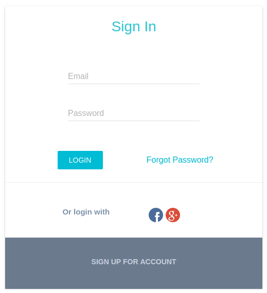

# React-Redux shipping tool



## About
This project is Redux Material UI using React.js, react-router, Redux, axios and Metronic Topic.
Making the project with registering, sign in, reSetting password and Management users easily. This Fabric example is written by [Big Silver].

## Development Installation

In the project's directory, run the following commands:

```bash
# Clone our repo
$ git clone https://github.com/Big-Silver/React-Redux-Material-UI.git React-Redux-Material-UI

# Change directory to your app
$ cd React-Redux-Material-UI

# Install the project
$ npm Install

# Run the project
$ npm start

```
Then Visit

```bash
http://localhost:3002
```
## Reference

Before the project, you have to change the API address at `package.json`.

```bash
"apiHost": "xxx.xxx.xxx.xxx"
"apiPort": "xxxx"
```


